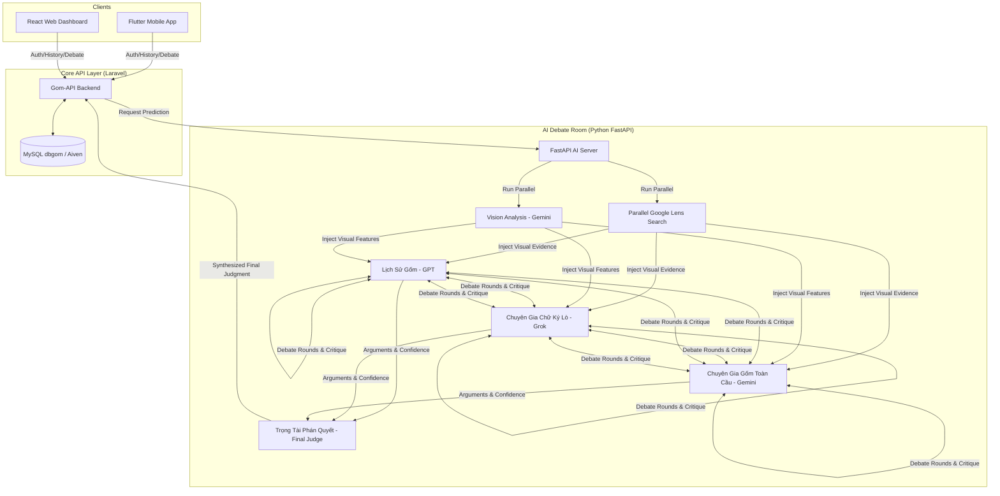

# 🏺 GOM AI - Hệ Thống Giám Định Gốm Sứ Đa Đại Lý Toàn Cầu

Một giải pháp giám định gốm sứ nghệ thuật chuyên nghiệp, tích hợp trí tuệ nhân tạo đa nguồn (GPT, Groq, Gemini) và đồng bộ hóa đa nền tảng (Mobile & Web).

---

## 🏗️ Hệ Sinh Thái GOM AI (Quad-Core Ecosystem)

Hệ thống được xây dựng trên kiến trúc **Tập trung hóa Dữ liệu (Centralized Data Strategy)**, đảm bảo trải nghiệm xuyên suốt cho nghệ nhân và nhà sưu tầm.

1.  **🧠 GOM-AI (Python/FastAPI)**: "Bộ não" xử lý thị giác (Vision) và quy trình tranh tập (Multi-Agent Debate Round).
2.  **🚀 GOM-API (Laravel)**: Cổng điều phối trung tâm, quản lý tài khoản (Sanctum Auth), Lưu trữ lịch sử và Database `dbgom`.
3.  **📱 GOM-APP (Flutter)**: Ứng dụng di động thực địa, cho phép giám định nhanh chóng qua Camera.
4.  **💻 GOM-WEB (React)**: Dashboard quản lý, dashboard phân tích chuyên sâu cho các màn hình lớn.

---

## 🔥 Tính Năng Độc Bản

-   **Multi-Agent Debate + Google Lens Integration**: Quy trình đột phá kết hợp **3 Chuyên gia AI chuyên sâu** tranh biện trực tuyến và tích hợp dữ liệu thực tế từ **Google Lens**:
    *   **Lịch Sử Gốm** (GPT-based): Chuyên sâu về niên đại thời kỳ, lịch sử các tuyến đường giao thương và quá trình tiến hóa chế tác.
    *   **Chuyên gia Chữ ký Lò và Hình thái Gốm** (Grok-based): Chuyên sâu về đặc trưng men gốm (Glaze Typology), dấu vết lò nung (Kiln signatures), cốt đất sét và hình thái chân đế.
    *   **Chuyên Gia Gốm Toàn Cầu** (Gemini-based): Chuyên sâu về hoa văn, biểu tượng văn hóa nghệ thuật và so sánh đối chiếu đa khu vực (Á Đông, Châu Âu, Trung Đông).
    *   **Google Lens Parallel Search**: Song song với phân tích thị giác, hệ thống kích hoạt luồng tìm kiếm hình ảnh thực tế từ các niên giám cổ vật và bảo tàng để cung cấp chứng cứ đắc lực, triệt tiêu sai số và sự nhầm lẫn giữa các dòng gốm tương đồng.
-   **Full Platform Sync**: Đăng ký một tài khoản, giám định trên App và xem lại lịch sử chi tiết trên Web ngay lập tức.
-   **Security & Profile**: Hệ thống bảo mật cao cấp cho phép quản lý thông tin nghệ nhân và thay đổi mã bảo vệ (Password) trực tuyến.
-   **Deep Analytics**: Xem lại toàn bộ lộ trình tranh tập của AI trong mục Chi tiết Lịch sử (History Detail).

---

## 🏗️ Sơ Đồ Kiến Trúc Luồng AI (Technical & AI Flow)



---

## ⚙️ Hướng Dẫn Cài Đặt (Setup Guide)

### 1. AI Server (`gom-ai`)
- Yêu cầu Python 3.10+
- Cài đặt thư viện: `pip install -r requirements.txt`
- Điền API Keys vào file `.env` (Gemini & Groq).

### 2. Backend API (`gom-api`)
- Chạy PHP 8.2 & MySQL.
- Thao tác: `composer install`, `php artisan migrate`, `php artisan serve`.
- Đảm bảo Database `dbgom` đã sẵn sàng.

### 3. Mobile App (`gom_app`)
- Cài đặt Flutter SDK.
- Thao tác: `flutter pub get`, `flutter run`.

### 4. Web App (`gom-web`)
- Yêu cầu NodeJS.
- Thao tác: `npm install`, `npm start`.

---

## 🚀 Cách Chạy Đồng Bộ (Operational Workflow)

Vận hành **4 Terminal** cùng lúc:
1.  **AI Engine**: `uvicorn app.main:app --host 0.0.0.0 --port 8001 --reload`
2.  **API Gate**: `php artisan serve` (Port: 8000)
3.  **Mobile**: `flutter run`
4.  **Web**: `npm start`

---

## 🌐 Triển Khai (Deployment)

### Hạ Tầng Production

| Service | Nền tảng | URL | Repo |
|---------|----------|-----|------|
| **Frontend** | Vercel | [thearchivistai.vercel.app](https://thearchivistai.vercel.app) | `tuaanns/gom-web` |
| **Backend** | Azure App Service | [thearchivist-...azurewebsites.net](https://thearchivist-edemdeeaf4ahamgs.southeastasia-01.azurewebsites.net) | `tuaanns/Gom` (GitHub Actions) |
| **Backup** | GitHub | — | `tuaanns/TheArchivist` |

### 🌐 Cấu Hình Google Lens Trên Production (Browserless.io)

Để chạy được Selenium quét Google Lens trên môi trường máy chủ đám mây (như **Azure App Service** - vốn không có sẵn môi trường đồ họa và Google Chrome), hệ thống hỗ trợ luồng định tuyến thông minh qua **Remote Cloud Browser**:

1. **Cách hoạt động**:
   - **Tại local**: Hệ thống dùng Chrome cài sẵn trên máy tính của bạn.
   - **Tại production**: Hệ thống tự động kết nối qua WebSocket tới cụm trình duyệt đám mây của **Browserless.io** khi phát hiện thấy biến cấu hình `BROWSERLESS_TOKEN`.
2. **Hướng dẫn thiết lập**:
   - Đăng ký tài khoản miễn phí (tặng 1000+ lượt quét/tháng) tại [Browserless.io](https://www.browserless.io/).
   - Copy mã **API Token** từ Dashboard chính của Browserless.
   - Thiết lập biến môi trường trên **Azure Portal** cho Web App **`TheArchivistAI`**:
     * **Key**: `BROWSERLESS_TOKEN`
     * **Value**: *(Mã Token của bạn)*
   - Khởi động lại App Service để áp dụng cấu hình mới. Trích dẫn Google Lens sẽ tự động kích hoạt thành công trên mọi nền tảng!

### 💳 Tài Khoản Thử Nghiệm VNPay (VNPay Sandbox Test Cards)

Khi thực hiện thanh toán thử nghiệm trên cổng Sandbox VNPay, vui lòng sử dụng thông tin thẻ dưới đây:

*   **Ngân hàng**: `NCB`
*   **Số thẻ**: `9704198526191432198`
*   **Tên chủ thẻ**: `NGUYEN VAN A`
*   **Ngày phát hành**: `07/15`
*   **Mật khẩu OTP**: `123456`
*   **Số tiền**: Tự do (VD: `50,000` VND)

---

### 🚀 Deploy Nhanh (1 lệnh duy nhất)

```powershell
# Deploy tất cả với message mặc định
.\deploy.ps1

# Deploy với message tùy chỉnh
.\deploy.ps1 -Message "Fix payment page"
```

Script `deploy.ps1` tự động thực hiện:
1. ✅ Commit tất cả thay đổi
2. ✅ Push lên `origin` → Azure backend auto-deploy
3. ✅ Push lên `secondary` → Backup repo
4. ✅ Sync `gom-web/` → repo `tuaanns/gom-web` → Vercel auto-deploy
5. ✅ Dọn dẹp thư mục tạm

### 📝 Deploy Thủ Công (từng bước)

```bash
# 1. Commit code
git add .
git commit -m "Update full system"

# 2. Push backend (Azure auto-deploy via GitHub Actions)
git push origin main

# 3. Push backup
git push secondary main

# 4. Sync frontend cho Vercel
git clone --depth 1 https://github.com/tuaanns/gom-web.git temp-gom-web
robocopy gom-web temp-gom-web /E /XD node_modules .git /XF .env /PURGE
cd temp-gom-web
git add -A && git commit -m "Sync updates" && git push origin main
cd .. && rmdir /s /q temp-gom-web
```

### 🧪 Chạy Local (Development)

Vận hành **4 Terminal** cùng lúc:

| # | Service | Lệnh | Port |
|---|---------|-------|------|
| 1 | AI Engine | `uvicorn main:app --port 8001` | 8001 |
| 2 | API Gate | `php artisan serve` | 8000 |
| 3 | Mobile | `flutter run` hoặc `flutter run -d chrome --web-port=63126` | — |
| 4 | Web | `npm run dev` | 5173 |

---

## 📂 Cấu Trúc Dự Án

```
Gom/
├── gom-ai/          # 🧠 Python FastAPI - AI Debate Engine
├── gom-api/         # 🚀 Laravel - Backend API + Auth + DB
├── gom-web/         # 💻 React + Vite - Web Dashboard
├── gom_app/         # 📱 Flutter - Mobile App
├── deploy.ps1       # 🚀 One-click deploy script
└── README.md
```