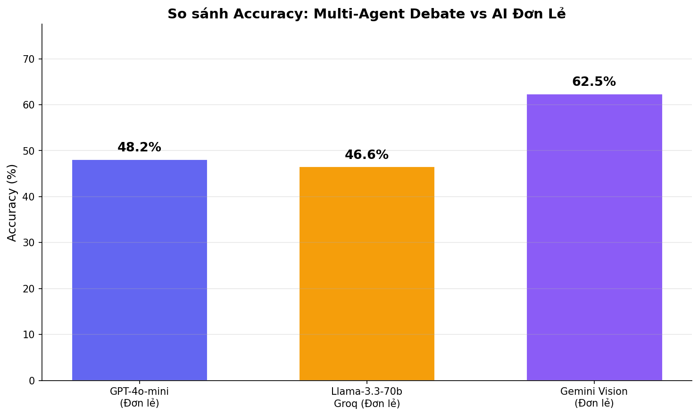
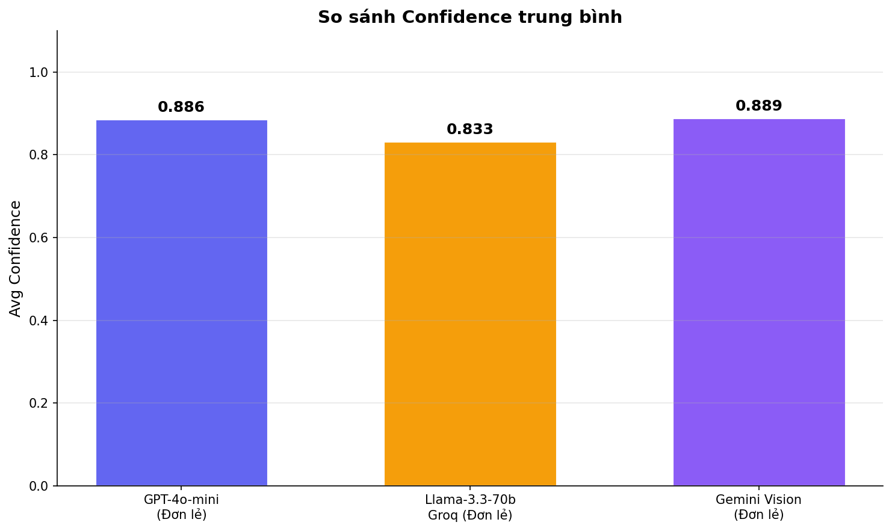
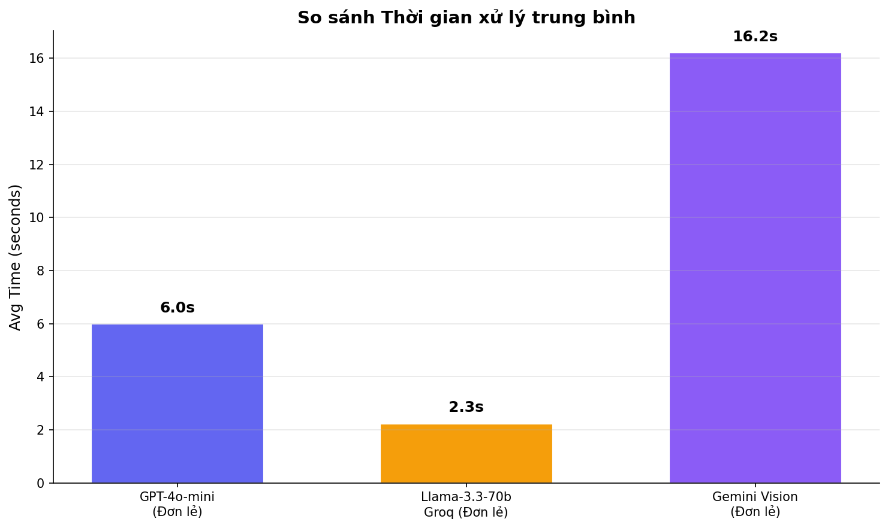
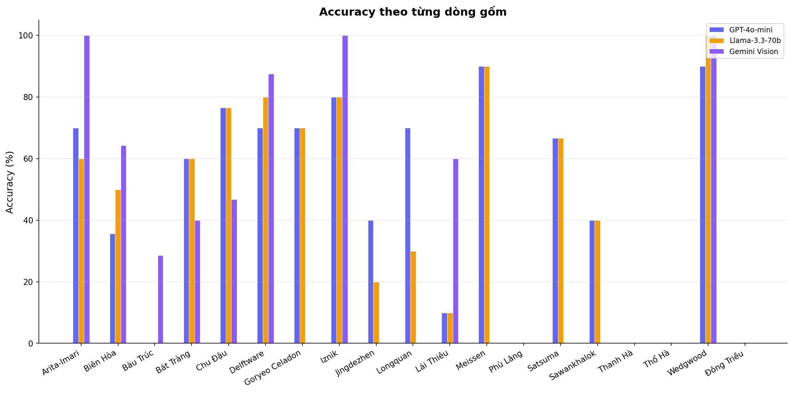
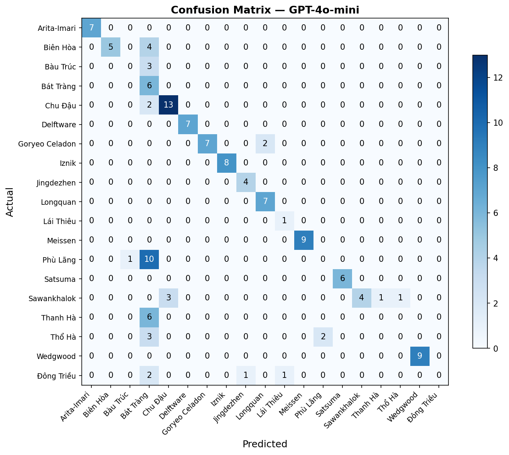
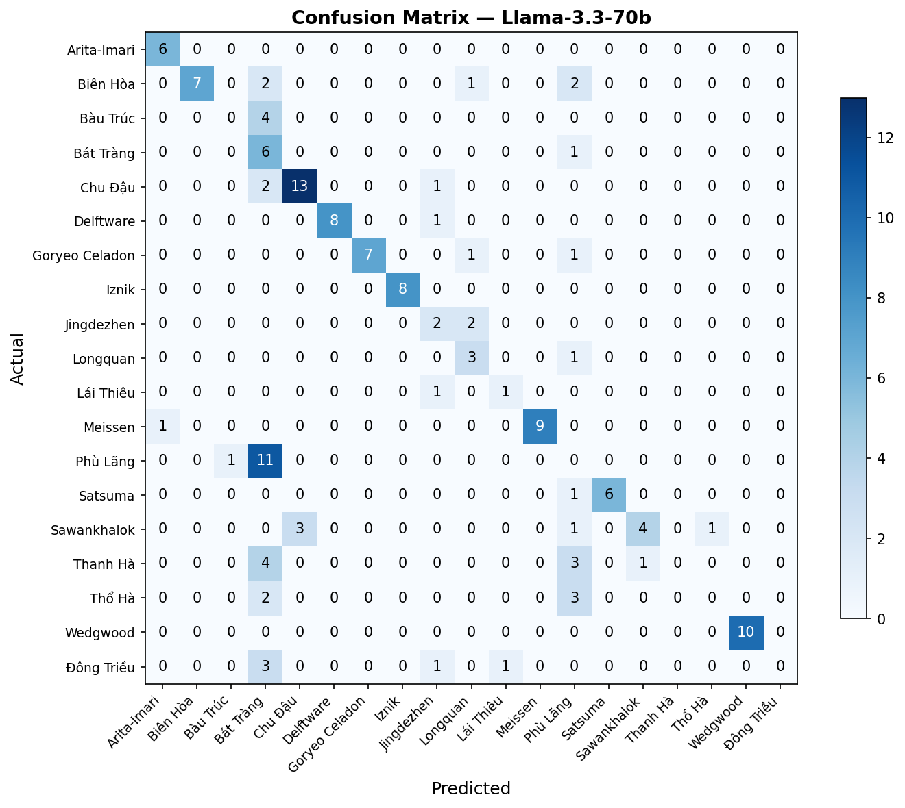
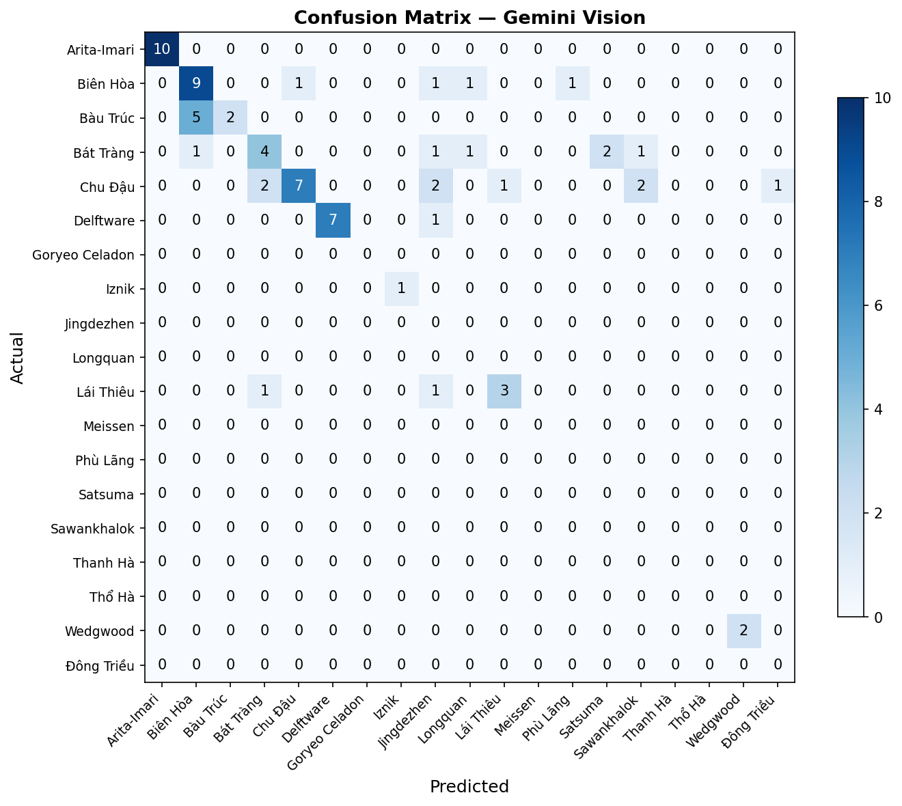

# 📊 Kết Quả Thực Nghiệm: Multi-Agent Debate vs AI Đơn Lẻ

*Generated: 2026-06-08 17:36:23*

## 1. Bảng So Sánh Tổng Hợp

| Phương pháp | Accuracy on success (%) | Coverage (%) | End-to-end accuracy (%) | Avg Confidence | Avg Time (s) | Correct/Successful |
|-------------|:-----------------------:|:------------:|:-----------------------:|:--------------:|:------------:|:------------------:|
| GPT-4o-mini | 48.19 | 98.97 | 47.69 | 0.8865 | 6.02 | 93/193 |
| Llama-3.3-70b | 46.63 | 98.97 | 46.15 | 0.8326 | 2.26 | 90/193 |
| Gemini Vision | 62.50 | 61.54 | 38.46 | 0.8893 | 16.22 | 45/72 |

## 2. Accuracy Theo Từng Dòng Gốm

| Dòng gốm | GPT-4o-mini | Llama-3.3-70b | Gemini Vision |
|----------|:---------:|:---------:|:---------:|
| Arita-Imari | 70.0% | 60.0% | 100.0% |
| Biên Hòa | 35.7% | 50.0% | 64.3% |
| Bàu Trúc | 0.0% | 0.0% | 28.6% |
| Bát Tràng | 60.0% | 60.0% | 40.0% |
| Chu Đậu | 76.5% | 76.5% | 46.7% |
| Delftware | 70.0% | 80.0% | 87.5% |
| Goryeo Celadon | 70.0% | 70.0% | 0.0% |
| Iznik | 80.0% | 80.0% | 100.0% |
| Jingdezhen | 40.0% | 20.0% | 0.0% |
| Longquan | 70.0% | 30.0% | 0.0% |
| Lái Thiêu | 10.0% | 10.0% | 60.0% |
| Meissen | 90.0% | 90.0% | 0.0% |
| Phù Lãng | 0.0% | 0.0% | 0.0% |
| Satsuma | 66.7% | 66.7% | 0.0% |
| Sawankhalok | 40.0% | 40.0% | 0.0% |
| Thanh Hà | 0.0% | 0.0% | 0.0% |
| Thổ Hà | 0.0% | 0.0% | 0.0% |
| Wedgwood | 90.0% | 100.0% | 100.0% |
| Đông Triều | 0.0% | 0.0% | 0.0% |

## 3. Biểu Đồ

### 3.1. So sánh Accuracy

### 3.2. So sánh Confidence

### 3.3. So sánh Thời gian

### 3.4. Accuracy theo dòng gốm

### Confusion Matrix — GPT-4o-mini

### Confusion Matrix — Llama-3.3-70b

### Confusion Matrix — Gemini Vision

